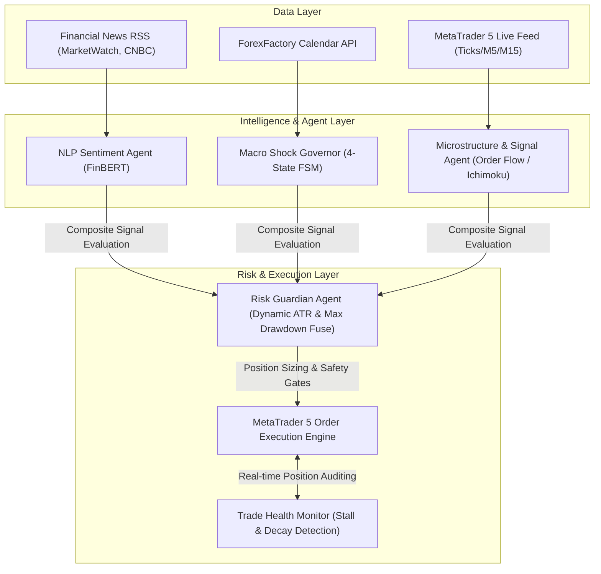

# MARK: Autonomous Multi-Agent Algorithmic Trading System

[](https://www.python.org/downloads/)
[](https://www.metatrader5.com/)
[](https://opensource.org/licenses/MIT)
[]()
[]()

An institutional-grade, event-driven autonomous algorithmic trading system for US equity index CFDs (**US30, US100, US500**) executing on **MetaTrader 5**. 

The system leverages a **Multi-Agent Collaborative Architecture** coordinating real-time NLP financial sentiment, macroeconomic event shock absorbers, microstructural order flow metrics, and trade health monitoring.

---

## 🏗️ Multi-Agent Architecture

Rather than relying on isolated indicators, the engine orchestrates four specialized autonomous agents communicating through an event-driven loop:



### Specialized Agents

1. **🧠 NLP Sentiment Intelligence Agent (`intelligence/nlp_sentiment_agent.py`):**
   * Continuously ingests streaming headlines from major financial outlets.
   * Runs lazy-loaded financial transformer models (`ProsusDE/finbert`) to quantify real-time market sentiment (-1.0 to +1.0) and prevent trading against major sentiment waves.
2. **⚖️ Macro Event Governor (`intelligence/fsm_governor.py` & `macro_event_scorer.py`):**
   * 4-State Finite State Machine protecting capital around high-impact economic releases (CPI, NFP, FOMC):
     * `NORMAL`: Standard trading.
     * `PRE_NEWS` (10m before): Freezes new entries, moves stops to breakeven.
     * `NEWS` ($\pm 2$m): Hard blackout preventing slippage disasters.
     * `POST_NEWS` (3-15m after): Scores surprise deltas (Actual vs. Forecast) to capture post-announcement momentum.
3. **📊 Microstructure & Order Flow Agent (`signal_engine/`):**
   * Analyzes institutional activity:
     * **Absorption (`absorption.py`):** Detects aggressive volume met by passive limit blocks.
     * **Pseudo-Delta (`pseudo_delta.py`):** Reconstructs aggressive buyer/seller pressure from tick streams.
     * **Cross-Asset Correlation (`correlation.py`):** Identifies inter-market divergences between US30 and US100.
     * **Ichimoku Cloud Engine (`ichimoku_strategy.py`):** Advanced trend regime confirmation.
4. **🛡️ Execution & Trade Health Guardian (`execution_engine/`):**
   * **Trade Health Monitor (`trade_health.py`):** Actively manages open positions; closes stagnant or decaying trades if momentum stalls before SL/TP is reached.
   * **Risk Manager (`risk_manager.py`):** Dynamic position sizing based on account equity, hard daily drawdown circuit breakers, and trailing profit locking.

---

## 📈 System Evolution (Engineering Roadmap)

* **MARK I (Technical Confluence):** Multi-timeframe trend-following baseline using H4/H1/M15/M5 technical indicators with Dash dashboard and Telegram alerts.
* **MARK II (Macro & AI Sentiment):** Integrated HuggingFace FinBERT and ForexFactory event logic with a 4-state Finite State Machine.
* **MARK III / v4.0 (Production Order Flow & Health Auditing):** Full microstructural decomposition, live MT5 trade health management, and Ichimoku trend alignment.

---

## 📁 Repository Structure

```
mark-agentic-trading-system/
├── config/
│   ├── settings.py              # Centralized Pydantic configuration & .env parsing
│   └── symbols.py               # Broker-specific contract specifications
├── data_handler/
│   ├── mt5_data.py              # High-performance MT5 candle & tick buffer
│   ├── economic_calendar.py     # ForexFactory JSON ingestion & parser
│   └── news_fetcher.py          # Multithreaded RSS financial news collector
├── intelligence/
│   ├── nlp_sentiment_agent.py   # FinBERT NLP sentiment extraction agent
│   ├── macro_event_scorer.py    # Economic event surprise calculation
│   ├── fsm_governor.py          # 4-state Finite State Machine (pre/post-news logic)
│   └── decision_engine.py       # Multi-agent weighted score aggregator
├── signal_engine/
│   ├── ichimoku_strategy.py     # Trend regime & cloud breakout logic
│   ├── absorption.py            # Passive order absorption detector
│   ├── pseudo_delta.py          # Tick-derived aggressive pressure calculator
│   ├── correlation.py           # Cross-index divergence detector (US30 vs US100)
│   └── scorer.py                # Multi-factor signal ranker
├── execution_engine/
│   ├── mt5_connector.py         # Robust MT5 socket connection & auto-reconnect
│   ├── order_manager.py         # Order placement, partial take-profits, trailing stops
│   ├── risk_manager.py          # Dynamic position sizing & daily drawdown fuse
│   └── trade_health.py          # Stagnant trade detector & proactive risk manager
├── monitoring/
│   ├── api_server.py            # FastAPI telemetry endpoint
│   ├── logger.py                # Dual console/file rotational logging
│   └── notifier.py              # Telegram push notification dispatch
├── main.py                      # Orchestrator & trading loop lifecycle
├── backfill_trades.py           # Historical trade reconciliation
├── requirements.txt             # Project dependencies
└── README.md
```

---

## 🚀 Quickstart Guide

### 1. Prerequisites
- **Python 3.10+**
- **MetaTrader 5** (logged into your demo/live account, e.g., Exness, FTMO)
- Enable **"Allow automated trading"** in MT5 (*Tools → Options → Expert Advisors*).

### 2. Setup
```bash
git clone https://github.com/YOUR_USERNAME/mark-agentic-trading-system.git
cd mark-agentic-trading-system
python -m venv .venv

# Activate venv
.venv\Scripts\activate   # Windows
source .venv/bin/activate # Linux/macOS

pip install -r requirements.txt
cp .env.example .env
```

### 3. Run in Safe Signal Mode
Start the engine in non-executing **SIGNAL** mode (generates signals, monitors telemetry, logs to console, but places zero live orders):
```bash
python main.py
```

### 4. Run in Autonomous Auto-Execution Mode (Demo First!)
```bash
python main.py --mode auto
```

---

## 🛡️ Risk Management Parameters

Default configuration safeguards accounts against catastrophic volatility:
- **Max Risk per Trade:** 1.0% of account equity.
- **Max Daily Drawdown:** 3.0% (hard system halt).
- **Max Positions:** 2 concurrent trades.
- **Circuit Breaker:** Automatic stop on major news release spikes.

---

## 📜 License
This project is licensed under the MIT License - see the LICENSE file for details.
